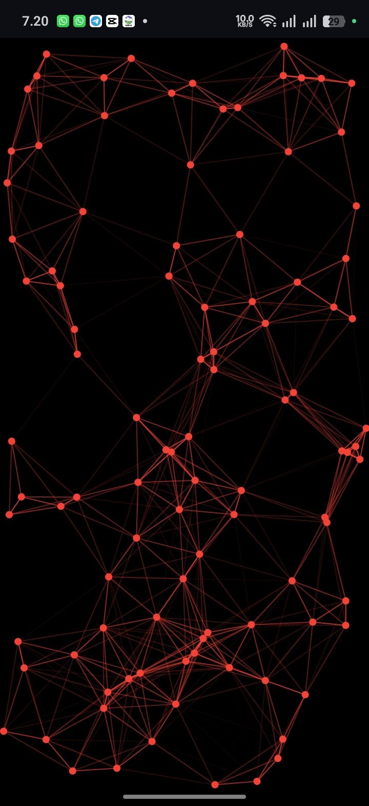
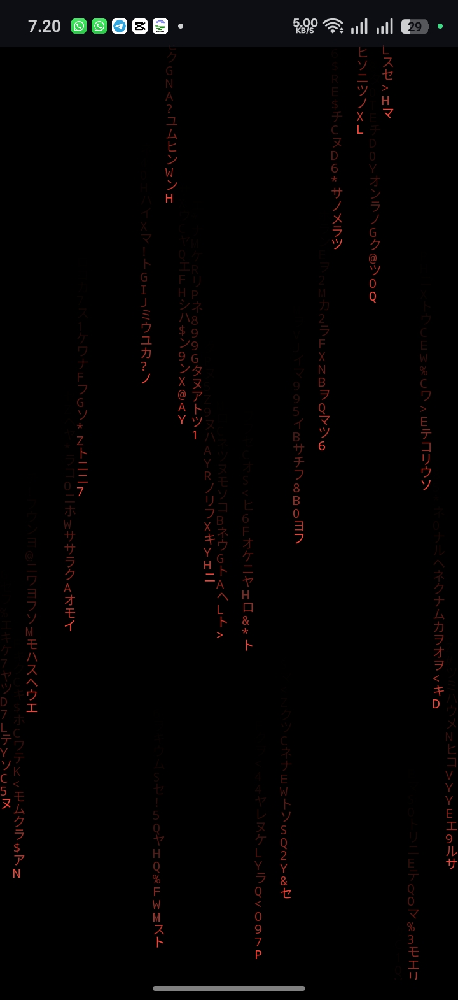
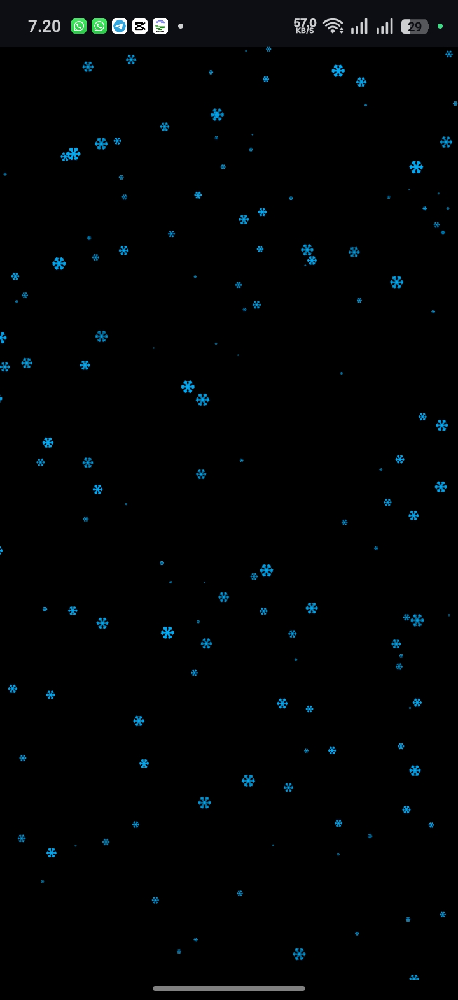

# LinearAnimationV2.0

LinearAnimationV2.0 adalah library untuk Sketchware yang digunakan untuk menambahkan animasi ke LinearLayout dengan berbagai mode efek visual.

---

## ✨ Fitur
Library ini menyediakan beberapa mode animasi:

- **MODE_SWIRL (0)** → Animasi berputar
- **MODE_BOUNCE (1)** → Animasi memantul
- **MODE_EXPLODE (2)** → Animasi menyebar seperti ledakan
- **MODE_WAVE (3)** → Animasi gelombang
- **MODE_MATRIX (4)** → Efek karakter jatuh ala matrix
- **MODE_SNOW (5)** → Efek jatuh seperti salju

Fitur tambahan:
- Support karakter unik (huruf Jepang, simbol, dll) untuk efek Matrix
- Ringan, tapi penggunaan efek tertentu bisa meningkatkan beban CPU

---

## ⚙️ Cara Pakai di Sketchware
1. Clone repo ini:
   https://github.com/Sketchware-TM/LinearAnimationV2.0

2. Masuk ke folder hasil clone

3. Copy file:
   - `classes.dex`
   - `classes.jar`

4. Buat folder dulu:
   `/storage/emulated/0/.sketchware/libs/local_libs/LinearAnimationV2.0` (kalo folder *local_libs* blm ada buat aja)

6. Paste ke folder:
   `LinearAnimationV2.0`

---

*Block sudah tersedia di repo, tinggal import ke Sketchware aja*

---

## ⚠️ Catatan
- Beberapa efek (seperti MATRIX & SNOW) bisa cukup berat di device low-end
- Beberapa mode kayak `MODE_BOUNCE`, `MODE_SWIRL`, `MODE_EXPLODE`, dan `MODE_WAVE` itu *sama* bedanya cuma gayanya aja

---
# Preview
**Preview 3 mode `MODE_BOUNCE`, `MODE_MATRIX`, dan `MODE_SNOW`**
## MODE_BOUNCE

## MODE_MATRIX

## MODE_SNOW

